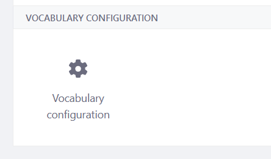

# Configuration Form Renderer

A Configuration Form Renderer allows rendering a specific UI. If yout want to execute a Action you have to use an Configuration ScreenContributor. 

As it can be seen .. liferay generate also the default UI in LIferay DXP.
HINT If you are trying to circumvent that by setting generateUI .. Is will completely hide the configuration category (but the category section is there)

```java
@ExtendedObjectClassDefinition(
    //generateUI = false,
    category = "vocabulary-configuration",
    scope = ExtendedObjectClassDefinition.Scope.COMPANY
)
```




## Sources

* https://help.liferay.com/hc/en-us/articles/360028726212-Customizing-the-Configuration-User-Interface
* https://help.liferay.com/hc/en-us/articles/360029045771-Configuration-Form-Renderer


