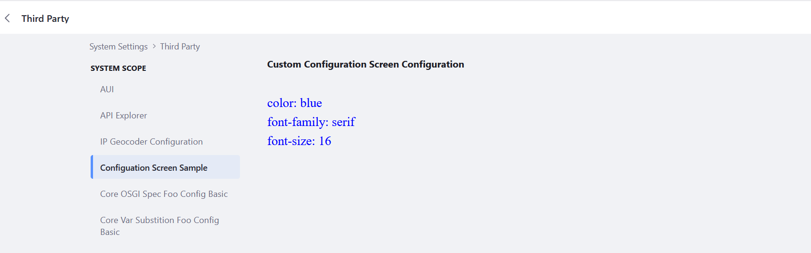

# Configuration Screen Sample

# Common Errors

+ The Configuration Screen Class binds a servlet context. If the configured symbolic name, does not match the symbolic name of the bundle you see nothing and everything deploys without errors.

# Sources

+ https://learn.liferay.com/w/dxp/development/traditional-java-based-development/core-frameworks/configuration-framework/completely-custom-configuration
