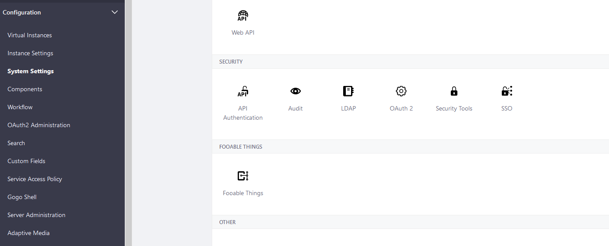
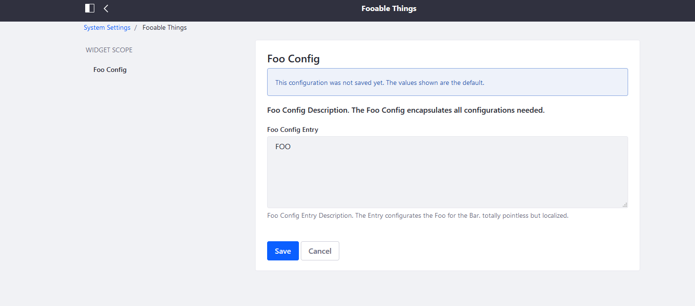

# Portlet Instance Scoped Configurations
Since DXP 7.2: 
Use PortletDisplay. This is the recommended approach for configurations at the PORTLET_INSTANCE scope, but only works at that scope.

"https://portal.liferay.dev/docs/7-2/frameworks/-/knowledge_base/f/reading-scoped-configuration-values"

## System Settings - Views

## Portlet - Views

## Know Issues

