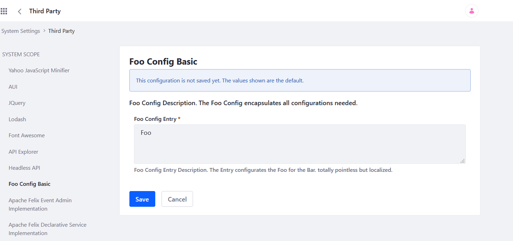

# OSGI Configuration example

The example consists of an Java annotation annotated with pure osgi metadata.
In Liferay DXP these componentes will be useable in:
_Control Panel > System Settings_ 

The default location is the Category Section _Plattform_ and the Category _Third Party_.

The default scope it the system scope.

 
