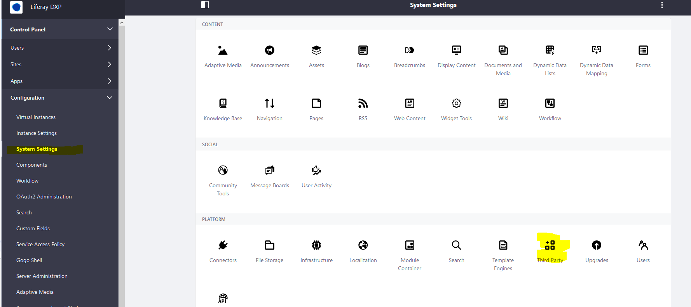
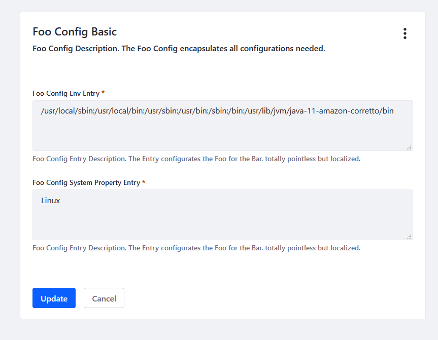

# OSGI Configuration example with variable substitution

NOT RUNNING IN LIFERAY DXP 7.3

The example consists of an Java annotation annotated with pure osgi metadata. 
In Liferay DXP these components will be useable in:
_Control Panel > System Settings_ 

The default location is the Category Section _Plattform_ and the Category _Third Party_.



The default scope is the system scope.


The sample demonstrates how to use environment & system properties in config files.
 
```
defaultEnvVar=${env:PATH}
defaultSystemPropVar=${os.name}
```


## Sources

* https://karaf.apache.org/manual/latest/#_configuration_3
* https://felix.apache.org/documentation/subprojects/apache-felix-file-install.html