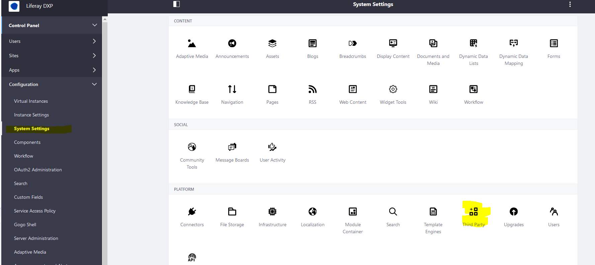
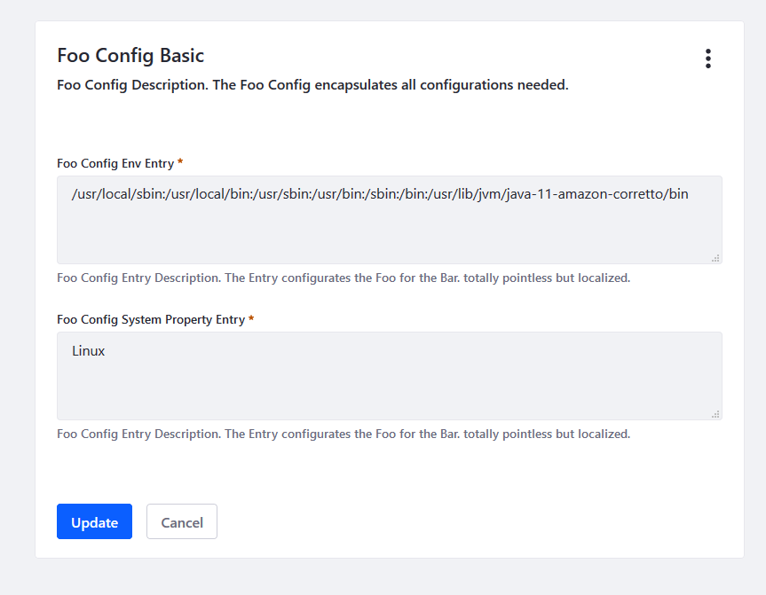

# IS NOT WORKING IN 2026 Q1 1.7

# OSGI Configuration example with variable substitution


The example consists of an Java annotation annotated with pure osgi metadata. 
In Liferay DXP these components will be useable in:
_Control Panel > System Settings_ 

The default location is the Category Section _Plattform_ and the Category _Third Party_.



The default scope is the system scope.


The sample demonstrates how to use environment & system properties in config files.
 
```
defaultEnvVar=${env:PATH}
defaultEnvVar=$[env:PATH]
defaultSystemPropVar=${os.name}
```
BY THE WAY: The liferay documentation says that the interpolation for the environment properties should now be working like that:
see [Liferay Learn Link]( "https://learn.liferay.com/w/dxp/security-and-administration/administration/configuring-liferay/configuration-files-and-factories/using-configuration-files#interpolating-environment-variables")

```
defaultEnvVar=$[env:PATH]

```

## Sources

* https://karaf.apache.org/manual/latest/#_configuration_3
* https://felix.apache.org/documentation/subprojects/apache-felix-file-install.html
